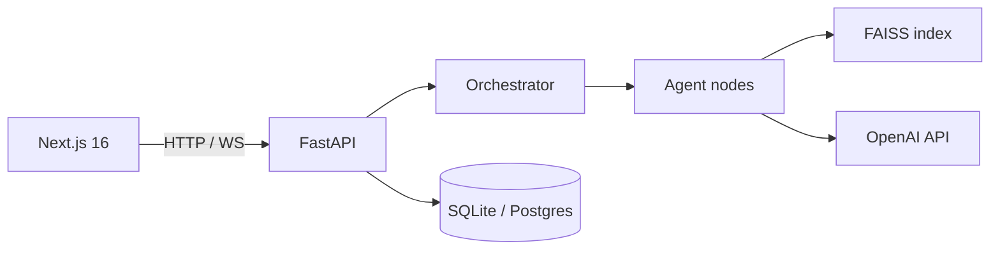

# PRO HR — Technical architecture

This document matches **what the code runs today**. For onboarding and marketing context, see the root [README](../README.md).

## Request path



- **Browser → API**: REST under `/api/*`, WebSocket under `/ws/{job_id}` with a **short-lived WS ticket** in the `token` query param (minted via authenticated **`GET /api/auth/ws-ticket?job_id=`**). The long-lived session JWT stays in an **HTTP-only cookie** for REST only.
- **Auth**: `backend/app/api/auth.py` — session cookie + JWT; HR-protected routes use `RequireHR` / `get_current_user`.

## Orchestration (source of truth)

**File:** `backend/app/core/orchestrator.py`

- The **orchestrator** is a **deterministic loop**: load `SharedState` from the `Job` row, run the agent function for the current `PipelineStage`, persist state, stop at **HITL breakpoints** or `COMPLETED`.
- **It is not LangGraph** at runtime. LangGraph is only used by optional scripts (see below).

**Wired agent modules (7 product-facing agents; eight Python entrypoints because offer is a dedicated stage):**

| Stage area | Python module | Notes |
|------------|---------------|--------|
| JD drafting | `app/agents/jd_architect.py` | |
| HITL (JD / shortlist / hire) | `app/agents/liaison.py` | Paused while approval fields are `pending` |
| Sourcing | `app/agents/scout.py` | Calls RAG search |
| Screening | `app/agents/screener.py` | |
| Outreach | `app/agents/outreach.py` | After shortlist approval |
| Engagement | `app/agents/response_tracker.py` | Reply / engagement tracking |
| Scheduling → interview → decision | `app/agents/coordinator.py` | Hire-review stage returns to `liaison.py` |
| Offer letter | `app/agents/offer_generator.py` | `OFFER` pipeline stage |

## RAG and vector search

**Files:**

- `backend/app/rag/embeddings.py` — **FAISS** via `langchain_community.vectorstores.FAISS`, OpenAI embeddings, default index path `data/faiss_index` under the backend working directory.
- `backend/app/rag/search.py` — thin wrapper calling `search_resumes`.
- `backend/app/rag/parser.py` — PDF/text parsing for uploads.

**ChromaDB:** Not used; retrieval is **FAISS** only (`embedding_model` / `openai_api_key` in settings).

## Resume indexing (two POST routes)

Both routes call `index_resume` → FAISS. Choose by whether the upload is tied to a job and pipeline rules.

| Route | Module | When to use |
|-------|--------|-------------|
| **`POST /api/jobs/{job_id}/resumes`** | `app/api/jobs.py` | **Default / UI.** Job must exist; `current_stage` must be `sourcing` or `screening`; **PDF only.** |
| **`POST /api/resumes/upload`** | `app/api/candidates.py` | **Deprecated** (OpenAPI + `Deprecation` / `Sunset` headers on response). Utility only; prefer job-scoped upload. **PDF or plain text**; no stage check. |

Indexed document count for dashboards: **`GET /api/resumes/count`** (`candidates.py`).

## Dependencies policy

- **`backend/requirements.txt`**: Everything needed to run **`uvicorn app.main:app`**, tests in `backend/tests/`, and CI (`pytest`).
- **`backend/requirements-dev.txt`**: Adds **`langgraph`**, **`requests`**, and everything in base requirements. Use for **`test_graph_standalone.py`** and for **manual HTTP scripts** in the repo root (`e2e_full_test.py`, etc.). Not installed in CI.

## Testing

### Automated (GitHub Actions and local)

CI runs **pytest** in three steps for clearer logs: **`tests/unit`** + **`tests/api`**, then **`tests/integration`**, then **`tests/e2e`**. All use the same in-memory SQLite strategy from `tests/conftest.py` (no live server).

Markers (see `backend/pyproject.toml`):

- **`unit`** — `tests/unit/`
- **`api`** — `tests/api/`
- **`integration`** — `tests/integration/`
- **`e2e`** — `tests/e2e/` (full pipeline, mocked agents)

Examples:

```bash
cd backend && export SECRET_KEY=your-32-char-minimum-secret-for-pytest
pytest -m "unit or api" -q     # fastest useful slice (~7 tests)
pytest -m integration -q
pytest -m e2e -q
```

### Manual HTTP “E2E” scripts (not in CI)

These modules expect **`uvicorn`** running on **`127.0.0.1:8000`**, demo accounts seeded when **`SEED_DEMO_USERS`** is set (and **`ALLOW_SEED_DEMO_USERS_OUTSIDE_DEV`** if `APP_ENV` is not dev — see `app/main.py` / README), and **`requests`** (`pip install -r requirements-dev.txt`):

- `backend/e2e_full_test.py`
- `backend/e2e_full_automation.py`
- `backend/e2e_alternative_paths_test.py`

They are **legacy naming** (older “7-agent” story); behavior is still useful for manual smoke checks. Do not rely on them in CI without a compose stack and stable fixtures.

### WebSocket auth note

For WebSockets, the query param must be a **short-lived WS ticket** (`aud=prohr-ws`, short `exp`, includes `job_id`) minted by **`GET /api/auth/ws-ticket?job_id=`**. The long-lived session JWT stays in the HttpOnly cookie path for REST.

`WS_ALLOW_LEGACY_BROWSER_TOKEN` defaults to **false**. Keep it false in production; enable only as a temporary rollback lever while migrating older clients.

## Frontend integration

- **`frontend/src/lib/api.ts`**: Axios to `/api` (same origin with rewrites) or `NEXT_PUBLIC_API_URL`.
- **`frontend/src/types/domain.ts`**: Shared shapes for jobs, workflow state, audit entries.
- **E2E:** `frontend/e2e/` Playwright smoke tests; see root README CI section.

## Observability

- **Request correlation:** HTTP middleware assigns/propagates `x-request-id` and logs request duration (`duration_ms`) and status.
- **Health counters:** `GET /api/health` includes in-memory counters for WS ticket issuance/denials and WS connect success/rejections.
- **Admin metrics endpoints:**
  - `GET /api/analytics/observability` (JSON)
  - `GET /api/analytics/metrics` (Prometheus-style plaintext)

## Environment & deployment inventory (Phase A)

| Symbol | Read at | Purpose |
|--------|---------|---------|
| **`NEXT_PUBLIC_API_URL`** | Next **build** → browser bundle | If **empty**, Axios uses **relative** `/api/...` (same origin as the page). If set, browser calls that **absolute** origin (must match CORS + cookie expectations). **`frontend/src/lib/api.ts`** |
| **`NEXT_PUBLIC_WS_URL`** | Next **build** → browser | WebSocket base for `connectWebSocket` (default `ws://localhost:8000`). **`frontend/src/lib/api.ts`** |
| **`BACKEND_URL`** | Next **build** → server | Target for **`next.config.ts` rewrites** (`/api/:path*` → backend). Inside Docker this must be the **container reachability** URL (e.g. `http://backend:8000`), not `localhost`. |
| **`FRONTEND_URL`** | Backend **runtime** (`Settings`) | CORS allow list and cookie/session semantics; must be the **origin users type in the browser** (e.g. `http://localhost:3000` for local Compose). **`app/config.py`**, **`app/main.py`** |
| **`CORS_EXTRA_ORIGINS`** | Backend runtime | Extra allowed origins (comma-separated). |
| **`AUTH_COOKIE_SECURE` / `AUTH_COOKIE_SAMESITE`** | Backend runtime | Production HTTPS / cross-site cookie policy. **`app/api/auth.py`** |
| **`WS_TICKET_EXPIRE_MINUTES`** | Backend runtime | Lifetime of JWTs used only for **`/ws/...?token=`** (`aud` `prohr-ws`). **`app/config.py`** |
| **`WS_ALLOW_LEGACY_BROWSER_TOKEN`** | Backend runtime | If **true**, WS accepts full session JWT in `token` (deprecated). **`app/config.ws_allow_legacy_browser_token`** |
| **HttpOnly `access_token` cookie** | Browser | Set by login **response**; sent on API requests with `withCredentials`. Scope follows the **response URL** (same-origin `/api` proxy → cookie for the Next host; direct `:8000` API → cookie for that host:port). |

### Compose files

| File | Use |
|------|-----|
| **`docker-compose.yml`** | **Default:** backend + frontend; **same-origin API** (empty `NEXT_PUBLIC_API_URL`, `BACKEND_URL=http://backend:8000`). Frontend waits for **`service_healthy`**. |
| **`docker-compose.direct-api.yml`** | **Override:** browser uses **`http://localhost:8000`** for REST + typical WS URL. Run: `docker compose -f docker-compose.yml -f docker-compose.direct-api.yml up --build`. |

### Deployment topologies

1. **Local dev (no Docker)** — `npm run dev` + `uvicorn`; `BACKEND_URL` / empty `NEXT_PUBLIC_API_URL` in `.env.local` as today.
2. **Docker Compose (default)** — User opens **`http://localhost:3000`**. Traffic to **`/api/*`** is rewritten by Next to **`http://backend:8000`**. Set **`FRONTEND_URL=http://localhost:3000`** in `backend/.env`.
3. **Direct API from browser** — Use **`docker-compose.direct-api.yml`** override; set **`NEXT_PUBLIC_API_URL`** and **`CORS`** so **`http://localhost:3000`** is allowed (already via `FRONTEND_URL` / defaults).
4. **Production (recommended)** — **One public HTTPS origin** (e.g. `https://app.example.com`) with a **reverse proxy**: `/api` and `/ws` routed to the FastAPI service; **`FRONTEND_URL`** and cookie **`Secure`** / **`SameSite`** aligned with that origin. Avoid exposing the backend origin separately unless required.

### Optional: backend on host, frontend only in Docker

Run the API on the host (`localhost:8000`) and build the frontend image with **`BACKEND_URL=http://host.docker.internal:8000`** (Docker Desktop) so **server-side rewrites** reach the host. Set **`NEXT_PUBLIC_API_URL=http://localhost:8000`** so the **browser** (on the host) calls the host API, or use same-origin proxy with a tunnel—prefer documented **`host.docker.internal`** only where supported.

## Related entrypoints

| Concern | File |
|---------|------|
| App factory, CORS, routers | `backend/app/main.py` |
| Workflow approve/reject/state | `backend/app/api/workflow.py` |
| Job CRUD, resume upload by job | `backend/app/api/jobs.py` |
| Global candidate/resume utilities | `backend/app/api/candidates.py` |
